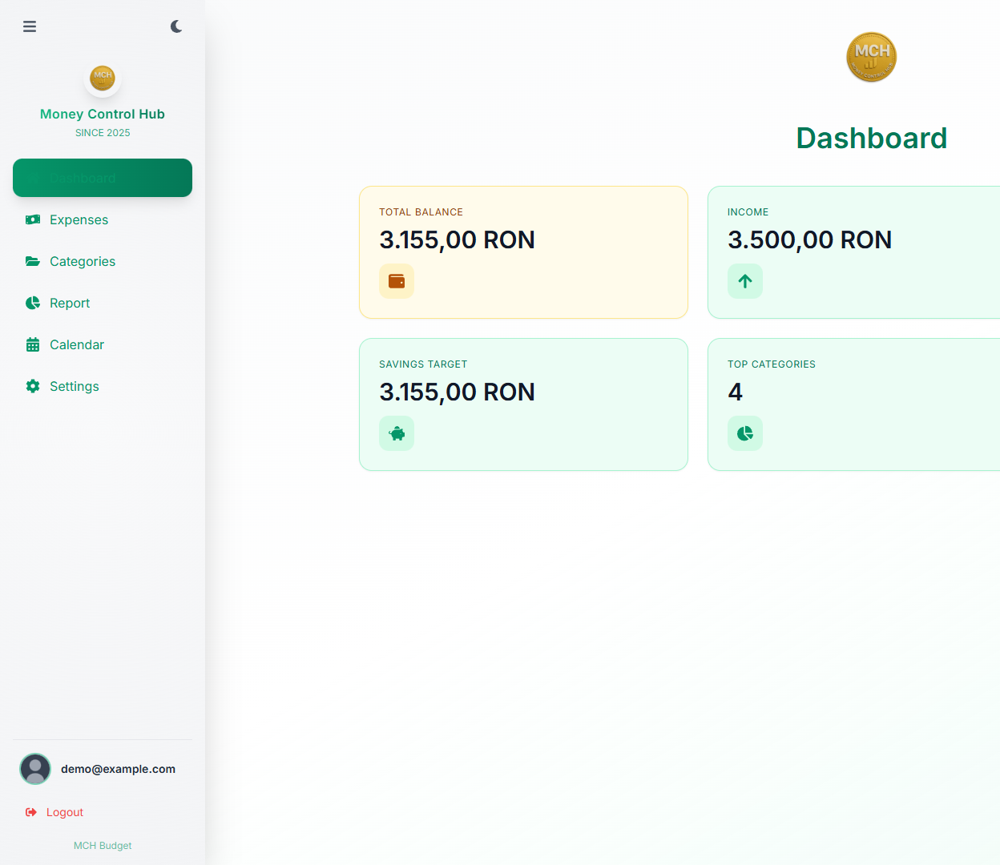
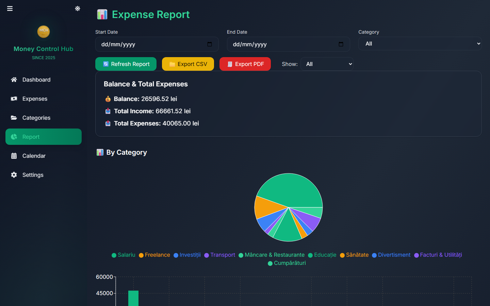
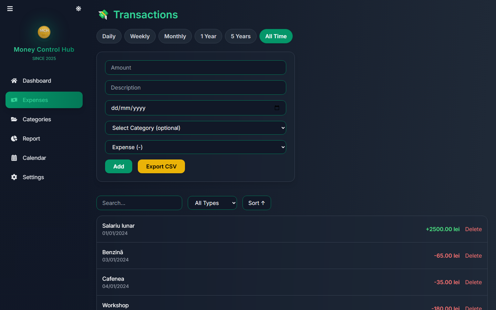
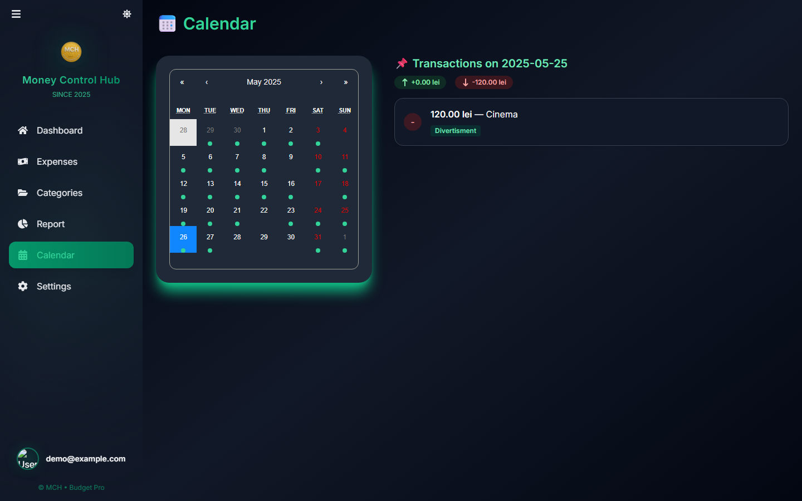

# Budget Manager

A full-stack personal budget management web application, built as my Bachelor's thesis project at Ovidius University of Constanța (Computer Science, 2025).

**Live demo:** [https://budget-manager-livid-three.vercel.app](https://budget-manager-livid-three.vercel.app)  
**API:** [https://budget-manager-u6l5.onrender.com](https://budget-manager-u6l5.onrender.com)

Track income and expenses, organize them by category, visualize your finances with interactive charts, browse transactions on a calendar, set monthly savings goals, and export reports to CSV or PDF — all in a modern, responsive UI with dark/light themes and full English/Romanian language support.

## Screenshots

| Dashboard | Reports & Charts |
|-----------|------------------|
|  |  |

| Transactions | Calendar |
|--------------|----------|
|  |  |

## Features

- **Authentication** — register/login with JWT, bcrypt-hashed passwords, protected routes
- **Transactions** — add, edit, delete income and expenses with categories, descriptions and dates; search, filter by type, sort, and view by time range (day / week / month / year / 5 years)
- **Categories** — full CRUD, per-user, duplicate detection
- **Dashboard** — animated overview cards for balance, income and expenses
- **Reports & charts** — interactive pie and bar charts (Recharts) with date-range filtering
- **Transaction calendar** — browse transactions day by day on a monthly calendar
- **Savings goals** — set and track a monthly savings goal
- **Export** — download reports as CSV (Excel-friendly, with summary rows) or PDF
- **Internationalization** — full EN/RO interface, including localized API error messages
- **Theming** — dark and light mode, responsive layout (TailwindCSS)

## Tech Stack

| Layer    | Technologies |
|----------|--------------|
| Frontend | React 18, React Router 6, TailwindCSS, Recharts, Framer Motion, Axios |
| Backend  | Node.js, Express, JWT, bcryptjs, PDFKit, json2csv |
| Database | MongoDB (Mongoose) — works with local MongoDB, MongoDB Atlas, or a zero-setup in-memory instance |

## Getting Started

### Prerequisites

- Node.js 18+ and npm
- MongoDB (optional — the app falls back to an in-memory database if no `MONGO_URI` is set)

### 1. Backend

```bash
cd backend
npm install
copy .env.example .env   # then edit .env if you want a persistent database
npm start
```

The API runs on `http://localhost:5000`.

If `MONGO_URI` is left empty, an in-memory MongoDB instance is started automatically — perfect for trying the app out (data is lost when the server stops).

### 2. Frontend

```bash
cd frontend
npm install
npm start
```

The app runs on `http://localhost:3000`.

### 3. Demo data (optional)

With both servers running, populate the app with ~3 months of realistic demo transactions:

```bash
npm install   # in the project root
node populate-demo-data.js
```

Then log in with `demo@example.com` / `demo123`. See [DEMO_DATA_README.md](DEMO_DATA_README.md) for details.

## Project Structure

```
├── backend/
│   ├── config/        # DB connection, env config, app constants
│   ├── controllers/   # Business logic (auth, expenses, categories, reports, export, PDF, settings)
│   ├── middleware/    # JWT auth middleware
│   ├── models/        # Mongoose schemas (User, Expense, Category)
│   ├── routes/        # Express routers (/api/...)
│   ├── utils/         # CSV export, PDF generation, i18n messages
│   └── server.js      # App entry point
├── frontend/
│   └── src/
│       ├── components/  # Layout, Sidebar, cards, loaders
│       ├── context/     # Theme, Language, Currency providers
│       ├── pages/       # Dashboard, Expenses, Categories, Report, Calendar, Settings, Login
│       └── utils/       # Axios instance with JWT interceptor
└── populate-demo-data.js
```

## API Overview

| Method | Endpoint | Description |
|--------|----------|-------------|
| POST | `/api/auth/register` | Create account, returns JWT |
| POST | `/api/auth/login` | Login, returns JWT |
| GET/POST/PUT/DELETE | `/api/expenses` | Transaction CRUD |
| GET/POST/PUT/DELETE | `/api/categories` | Category CRUD |
| GET | `/api/reports` | Balance, income, expenses, per-category summary |
| GET | `/api/export/expenses` | CSV export (with optional `start`/`end` date filters) |
| GET | `/api/pdf/report` | PDF report |
| GET/POST | `/api/settings/savings-goal` | Read / set the savings goal |

All routes except auth require an `Authorization: Bearer <token>` header. Send `Accept-Language: ro` for Romanian error messages.

## Author

**Aydin Berk Tumerdem** — [LinkedIn](https://www.linkedin.com/in/aydin-berk-tumerdem-95a572286/) · [GitHub](https://github.com/BerkTumerdem)

## Free deployment (overview)

| Part | Free host |
|------|-----------|
| Database | [MongoDB Atlas](https://www.mongodb.com/cloud/atlas) (M0 free cluster) |
| Backend | [Render](https://render.com) (Web Service, free) |
| Frontend | [Vercel](https://vercel.com) (Project from `frontend/`) |

1. Create an Atlas cluster, get `MONGO_URI`, allow network access `0.0.0.0/0`.
2. On Render, deploy the `backend` folder with env vars: `MONGO_URI`, `JWT_SECRET`, `FRONTEND_URL` (your Vercel URL).
3. On Vercel, set Root Directory to `frontend` and env var `REACT_APP_API_URL` to `https://<your-render-service>.onrender.com/api`.

Note: the free Render tier spins down after inactivity — the first request after idle can take ~30–60 seconds.
